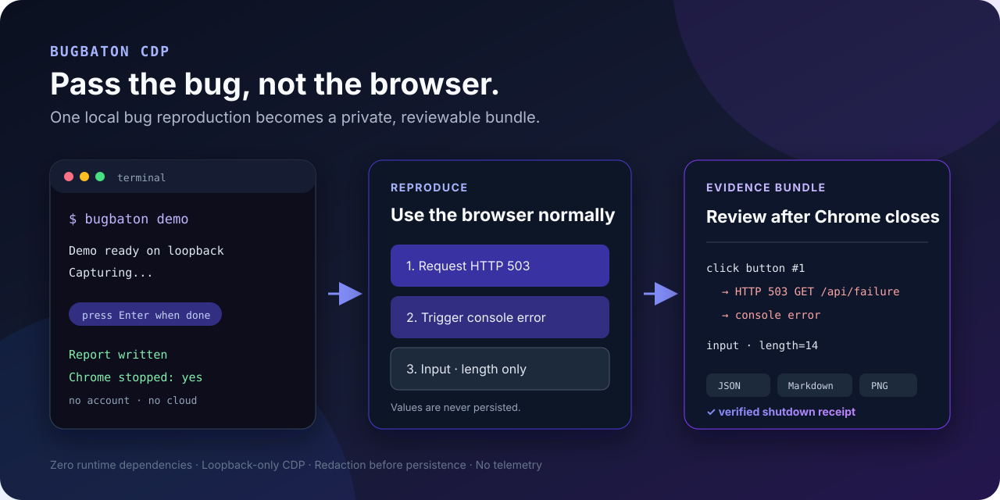
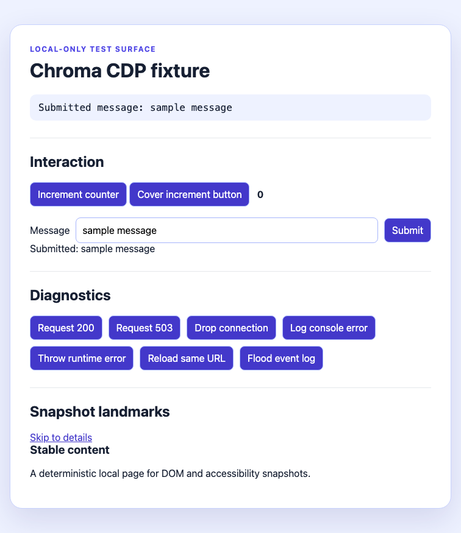
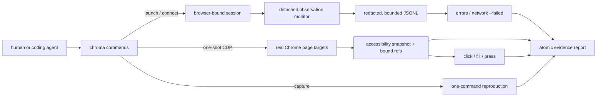

# Chroma CDP

[](https://github.com/mun-jeong-min/Chroma/actions/workflows/ci.yml)
[](LICENSE)
[](package.json)

**Reproduce once. Close Chrome. Keep the evidence.**

Chroma CDP is a zero-dependency local flight recorder for a browser bug you can
reproduce but have not automated yet. One command opens an isolated Chrome,
records a value-free action trail, console errors, failed requests, page state,
browser identity, and a screenshot, then writes ordinary JSON, Markdown, and PNG
files and shuts the session down.

No account. No cloud. No browser extension. No MCP server. No telemetry.



**[Open the real sample report](docs/example-report/README.md)** ·
**[Inspect its versioned JSON](docs/example-report/report.json)** ·
**[Verify its shutdown receipt](docs/example-report/capture-receipt.json)**

```text
click button #7
  -> HTTP 503 GET /api/http-error
  -> console error: fixture:request-failed
input input #4 (length=14; value never persisted)
submit form
```

## See it work in 30 seconds

Run the packaged local-only demo. It needs no existing app, clone, account, or
global install:

```sh
npm exec --yes --package=github:mun-jeong-min/Chroma#1547fbb -- chroma demo
```

Follow the three steps in the Chrome window, then press Enter. Chroma captures
the report and safely closes only the browser process it launched and verified.

```console
$ chroma demo
Demo ready at http://127.0.0.1:61990. Follow the three steps in Chrome.
Capturing. Reproduce the bug in Chrome, then press Enter or Ctrl+C here.
Demo complete
Wrote report to ./chroma-report-2026-09-02T12-59-56-058Z-6808
3 errors, 1 failed request, 4 reproduction actions
Chrome session stopped: yes
```

`capture` picks a free loopback CDP port and a unique report path automatically,
so the same command can be run again. Use `--duration 30` instead of Enter for
scripts and coding agents. Every command also has a versioned `--json` envelope.



### Use it on your app

Start your local app, replace the URL, and run the same capture loop:

```sh
npm exec --yes --package=github:mun-jeong-min/Chroma#1547fbb -- \
  chroma capture --url http://127.0.0.1:3000
```

> **Pre-release 0.1.0:** install directly from GitHub for now. The full local
> lane is verified on Chrome 152/macOS. Public CI passes the real-Chrome lane on
> Linux and macOS plus the quality gate on Windows; the first npm release is next.

## Why this instead of another browser controller?

> **Use Playwright to automate a known flow. Use DevTools or a browser MCP for
> live investigation. Use Chroma when the evidence must outlive that session.**

Chroma does not try to drive every browser workflow or find the root cause. It
freezes the gap between “I can make it break” and “I have an automated repro”
into a bounded artifact that another person or tool can inspect without live
browser access.

| What you actually need | Better fit |
| --- | --- |
| Production errors across real users | Sentry or your observability stack |
| A network-only capture | Chrome HAR or NetLog export |
| A repeatable automated browser test | Playwright |
| Open-ended live investigation | DevTools, BrowserTools MCP, or Chrome DevTools MCP |
| Proof of an agent's completed change | ProofShot |
| One human-found local bug that must survive and travel | **Chroma CDP** |

The unusual work is evidence integrity rather than CDP transport: observation
boundaries, browser and tab identity, redaction before persistence, bounded-loss
health, fail-closed target selection, and atomic reports with attachment hashes.
Temporal proximity is labeled low-confidence and never presented as proof of
cause.

The [competitive research](docs/research.md) includes community evidence,
counterexamples such as `peek`, and the limits of this position. The
[product/CLI decision record](docs/decisions/0001-product-and-cli.md) documents
the safety contract.

## How it fits together



Interactive commands are short-lived. The monitor is the only background
component; it keeps best-effort evidence across shell invocations, while the
browser-instance binding prevents evidence and refs from crossing sessions.

## Requirements

- Node.js 22 or newer (uses the built-in WebSocket client)
- Google Chrome, Chromium, or Chrome Canary
- macOS or Linux today; Windows Chrome discovery is implemented but not yet end-to-end verified

No runtime npm dependencies are required.

## Install

Until a release is published, install the current main branch directly:

```sh
npm install --global github:mun-jeong-min/Chroma#1547fbb
chroma --version
```

For development, install from a local clone:

```sh
git clone https://github.com/mun-jeong-min/Chroma.git chroma
cd chroma
npm link
chroma --version
```

Or run without installing:

```sh
node bin/chroma.js --help
```

The package name `chroma-cdp` is intended for the first npm release but is not
published yet.

## Reuse a signed-in development profile

Some local bugs need authentication. Use a dedicated reusable profile instead
of your everyday Chrome profile:

```sh
chroma capture --profile "$HOME/.local/share/chroma/profiles/my-app" \
  --url http://127.0.0.1:3000
```

Log in during the first capture and reuse the same path later. Chroma warns when
an explicit profile is used because pages can read and modify that profile; never
point it at Chrome's default user-data directory.

## Advanced workflow

`capture` is the normal first run. Use the individual commands when a person or
agent needs to inspect or control each stage. Launch an isolated Chrome profile
with CDP bound to loopback:

```sh
chroma doctor
chroma launch --url http://127.0.0.1:3000
chroma tabs
chroma snapshot
```

The snapshot prints semantic references:

```text
@e1 button "Save"
@e2 textbox "Email"
```

Use those references to minimally reproduce the issue:

```sh
chroma fill @e2 "dev@example.test"
chroma click @e1
chroma errors
chroma network --failed
chroma screenshot --full-page --output page.png
chroma report --output ./chroma-report
chroma stop
```

For values that should not appear in shell history or the process list, use
`printf '%s' "$VALUE" | chroma fill @e2 --stdin`. Chroma removes one trailing
line ending and still records only the character count.

To attach to a Chrome you started yourself:

```sh
google-chrome --remote-debugging-port=9222 --user-data-dir=/tmp/chroma-profile
chroma connect http://127.0.0.1:9222
```

Recent Chrome versions require a non-default `--user-data-dir` for remote debugging. `chroma launch` handles this automatically with an isolated profile.

## Commands

| Command | Purpose |
| --- | --- |
| `doctor` | Read-only runtime, Chrome, state, endpoint, and monitor diagnosis |
| `demo` | Run the full capture loop against a packaged, local-only failure page |
| `capture` | Launch, record a privacy-safe manual reproduction, report, and stop |
| `launch` | Start isolated Chrome on loopback and begin observation |
| `connect [ENDPOINT]` | Save and verify an existing endpoint, then begin observation |
| `stop` | Stop observation and close only a verified Chroma-owned Chrome process |
| `tabs` | List page targets only |
| `snapshot` | Accessibility snapshot with tab-bound `@eN` references |
| `click` | Dispatch a CDP mouse click to a snapshot ref or explicit `--selector CSS` |
| `fill` | Set a fillable element value; output records only character count |
| `press` | Dispatch a supported key to the page or a focused ref |
| `errors` | Observed console warnings/errors, exceptions, and browser log errors |
| `network --failed` | Observed transport failures and HTTP 4xx/5xx responses |
| `screenshot` | PNG capture, optionally `--full-page` |
| `report` | Local `report.json`, concise `README.md`, and optional screenshot |
| `version` | Cheap, read-only version probe |

Run `chroma <command> --help` for exact arguments. Global options can follow the command options in any order:

```text
--json
--endpoint URL
--state-dir PATH
--allow-remote
-v, --verbose
```

Use the standard `--` separator when a positional value starts with `-`, for
example `chroma fill @e2 -- -draft`.

`--tab` first tries an exact target ID, then a unique ID prefix, URL substring,
or title substring. When multiple page tabs are open, diagnostics, page captures,
and mutations require an explicit tab instead of risking disclosure or action in
the wrong page. Snapshot refs are bound to browser instance, endpoint, target ID,
URL fingerprint, and document loader; after browser replacement, navigation, or
reload, Chroma refuses a stale ref and asks for a new snapshot.

For repeatable fixture/CI runs, `launch --deterministic` also disables Chrome background networking, component updates, default apps, and extensions. It is intentionally off in normal use so Chroma does not hide extension or service-worker behavior involved in a real bug.

## JSON for agents and scripts

Successful commands write exactly one JSON object plus a newline to stdout:

```json
{
  "schemaVersion": 1,
  "ok": true,
  "command": "network",
  "data": {
    "observationStartedAt": "2026-09-02T06:29:58.649Z",
    "monitorRunning": true,
    "bestEffort": true,
    "count": 1,
    "events": []
  },
  "error": null
}
```

Errors use the same envelope with `ok: false`, `data: null`, and stable `code`, `message`, `retryable`, plus optional `hint` and `details`. Progress stays on stderr. Exit codes are `0` for a completed command (findings are valid results), `1` for an operation failure, `2` for usage or policy refusal, and `3` when Chrome/CDP is unavailable.

## Observation model

Chrome does not provide retroactive console or Network event history. After
`capture`, `launch`, or `connect`, Chroma starts a detached local monitor that
attaches to current and newly opened page targets. `errors`, `network --failed`,
and `report` read its append-only, target-tagged event log without consuming each
other's evidence. `capture` additionally records manual click, input-length,
control-key, and submit events with element category and page ordinal, without
storing typed values or page text as action labels.

Every diagnostic result includes:

- `observationStartedAt`: when the current monitor began;
- `monitorRunning`: whether collection is alive now;
- `bestEffort: true`: explicit acknowledgement that events before attachment can be missing.

`--clear` writes a scoped checkpoint for the selected tab and event family; it does not erase another tab's evidence.

State defaults to `~/.local/state/chroma` and can be isolated with `CHROMA_STATE_DIR` or `--state-dir`. State files are owner-only and include the current connection, snapshot bindings, monitor metadata, and redacted JSONL observations. A new `launch`/`connect` creates a new session ID and observation window; an unexpected monitor restart in the same session is recorded as a discontinuity.

## Security boundary

CDP is browser-level control. Anyone who can reach the endpoint may read page content, execute JavaScript and actions, and access authenticated pages. Chroma is not a sandbox.

- `launch` binds CDP to loopback and uses an isolated profile by default.
- Non-loopback endpoints are refused unless that invocation includes `--allow-remote`; Chroma does not authenticate them.
- Passing `--profile` may expose and modify authenticated browser state. Prefer the default isolated profile.
- URL credentials, sensitive query values, Bearer/Basic credentials, and common token assignments are redacted before monitor persistence.
- Request/response bodies, cookies, authorization headers, storage values, and `fill` text are not collected by default.
- Manual action capture stores element category, control keys, and input length, never input text.
- Screenshots, page titles, accessible names, and console prose can still contain sensitive information. Review every report before sharing.
- Chroma does not upload reports, expose tunnels, send telemetry, bypass TLS warnings, or publish anything.

## Known limits

- Event capture begins after `capture`, `launch`, or `connect`; navigation history from before that point cannot be recovered.
- The monitor is best effort, not a lossless trace recorder. Its current JSONL tail is bounded to 5 MiB; oversized strings are visibly marked and counted. String truncation, rotations/drops, write failures, unknown restart gaps, and corrupt lines degrade diagnostic/report health.
- Frames and shadow DOM are represented only as Chrome exposes them in the accessibility tree; cross-origin frame interaction is not first-class.
- `press` supports common navigation/editing keys and single characters, not full keyboard chord syntax.
- `fill` targets HTML input/textarea value semantics; contenteditable and file uploads are not supported.
- Report screenshots and accessible names require manual privacy review.
- Windows and remote endpoint workflows need broader E2E coverage.

## Development and verification

```sh
npm test
npm run check
npm run test:e2e
```

The fixture is a dependency-free local app with deterministic controls for click/fill/press, console error, uncaught exception, HTTP 503, and transport disconnect. The [verification plan](docs/verification-plan.md) defines the real-Chrome evidence required before release; [validation results](docs/validation.md) record the latest run.

See [CONTRIBUTING.md](CONTRIBUTING.md) for the product boundary, test ladder,
and evidence expected in a change.

## Project status

This is an MVP under active validation. The next priorities are an npm release,
independent first-use testing, higher-confidence action/failure correlation,
redirect and duplicate normalization, and Windows real-browser E2E.
Contributions that sharpen diagnosis or evidence handoff are more valuable than
adding broad automation verbs.
