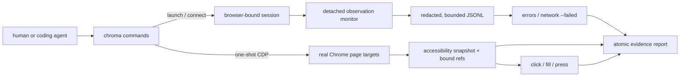

# Chroma

**Reproduce the web app bug once. Let whoever fixes it see the same browser evidence.**

Chroma records the Chrome tab while you reproduce a problem, then bundles the
page state, console errors, failed requests, browser identity, and screenshot
into one trustworthy report for you, your teammate, or your coding agent. No
automation script. No reopening DevTools to copy the same clues. No explaining
the bug again from memory.

It is an open-source, shell-native CDP diagnostics CLI. Human output is compact;
every command also supports a stable `--json` envelope.

> **Pre-release 0.1.0:** the real-Chrome workflow is verified on macOS. Linux
> and Windows E2E remain open, and no npm release has been published.

```console
$ chroma errors
2026-09-02T06:32:25.281Z ERROR fixture:request-failed Error: HTTP 503 Service Unavailable

$ chroma network --failed
503 http://127.0.0.1:4173/api/http-error
FAIL net::ERR_EMPTY_RESPONSE

$ chroma report
Wrote report to ./chroma-report-2026-09-02T06-33-40-101Z-1234
2 errors, 2 failed requests, 17 snapshot nodes
```

## The debugging loop Chroma removes

A local page breaks. You reproduce it, search Console, find the red request in
Network, copy a stack and status code, take a screenshot, note the browser
version, and paste the pieces into an issue or an AI chat. If one clue is missing
or came from a different run, the next person asks you to reproduce it again.

With Chroma, start observation first, reproduce once, then run `chroma report`.
The result keeps those clues in one bounded, redacted, provenance-bearing bundle
that can be inspected from the shell or handed off as files.

This job is broader than a Chroma-specific hunch: a 2025 survey of 3,500
developers and managers names finding information and context switching among
the largest developer time-wasters, while Stack Overflow's survey reporting says
63% of respondents worry that AI tools lack crucial organizational context.
Official browser guidance still asks reporters to supply a reproduction,
environment facts, screenshots, and complete diagnostic logs. See the
[problem validation and source limits](docs/research.md#개발자-문제-검증) behind
the positioning.

## Why another Chrome tool?

> **Playwright automates browser flows. DevTools helps you investigate a live
> browser. Chroma preserves one reproduction, so whoever fixes the bug does not
> start from scratch.**

It is not the CDP transport, existing-browser attachment, accessibility refs, or JSON alone. Chrome DevTools MCP and Playwright CLI already cover much of that surface. Chroma is deliberately narrower:

- `doctor` diagnoses local binary/session/endpoint/monitor readiness and gives one next action.
- A lightweight monitor keeps a bounded, health-labeled, best-effort tail of tab-tagged console, runtime, Log, and Network failures across separate shell invocations.
- `errors` and `network --failed` expose an honest observation start and `bestEffort` state instead of pretending Chrome has retroactive history.
- `report` creates one schema-versioned manifest from a recorded evidence boundary, with browser/protocol identity, redaction policy, section provenance, snapshot, findings, and SHA-256 attachment integrity.
- Report timelines label nearby action/finding pairs as low-confidence temporal correlation; proximity is never presented as proof of cause.
- `click`, `fill`, and `press` exist only to minimally reproduce a diagnosis; Chroma is not a general browser workflow framework.

See the [competitive research](docs/research.md) and [product/CLI decision record](docs/decisions/0001-product-and-cli.md) for the evidence and tradeoffs behind this wedge.

Use Chroma to diagnose and hand off a local-Chrome failure. Use Playwright for
test suites and cross-browser automation, Chrome DevTools MCP for deep
performance/heap/Lighthouse work, and raw-CDP tools for arbitrary protocol
commands.

## How it fits together



Interactive commands are short-lived. The monitor is the only background
component; it keeps best-effort evidence across shell invocations, while the
browser-instance binding prevents evidence and refs from crossing sessions.

## Requirements

- Node.js 22 or newer (uses the built-in WebSocket client)
- Google Chrome, Chromium, or Chrome Canary
- macOS or Linux today; Windows Chrome discovery is implemented but not yet end-to-end verified

No runtime npm dependencies are required.

## Install

Until a release is published, install from a local clone:

```sh
git clone https://github.com/mun-jeong-min/Chroma.git chroma
cd chroma
npm link
chroma --version
```

Or run without installing:

```sh
node bin/chroma.js --help
```

This repository intentionally contains no publish or deployment step.

## Quick start

Launch an isolated Chrome profile with CDP bound to loopback:

```sh
chroma doctor
chroma launch --url http://127.0.0.1:3000
chroma tabs
chroma snapshot
```

The snapshot prints semantic references:

```text
@e1 button "Save"
@e2 textbox "Email"
```

Use those references to minimally reproduce the issue:

```sh
chroma fill @e2 "dev@example.test"
chroma click @e1
chroma errors
chroma network --failed
chroma screenshot --full-page --output page.png
chroma report --output ./chroma-report
```

For values that should not appear in shell history or the process list, use
`printf '%s' "$VALUE" | chroma fill @e2 --stdin`. Chroma removes one trailing
line ending and still records only the character count.

To attach to a Chrome you started yourself:

```sh
google-chrome --remote-debugging-port=9222 --user-data-dir=/tmp/chroma-profile
chroma connect http://127.0.0.1:9222
```

Recent Chrome versions require a non-default `--user-data-dir` for remote debugging. `chroma launch` handles this automatically with an isolated profile.

## Commands

| Command | Purpose |
| --- | --- |
| `doctor` | Read-only runtime, Chrome, state, endpoint, and monitor diagnosis |
| `launch` | Start isolated Chrome on loopback and begin observation |
| `connect [ENDPOINT]` | Save and verify an existing endpoint, then begin observation |
| `tabs` | List page targets only |
| `snapshot` | Accessibility snapshot with tab-bound `@eN` references |
| `click` | Dispatch a CDP mouse click to a snapshot ref or explicit `--selector CSS` |
| `fill` | Set a fillable element value; output records only character count |
| `press` | Dispatch a supported key to the page or a focused ref |
| `errors` | Observed console warnings/errors, exceptions, and browser log errors |
| `network --failed` | Observed transport failures and HTTP 4xx/5xx responses |
| `screenshot` | PNG capture, optionally `--full-page` |
| `report` | Local `report.json`, concise `README.md`, and optional screenshot |
| `version` | Cheap, read-only version probe |

Run `chroma <command> --help` for exact arguments. Global options can follow the command options in any order:

```text
--json
--endpoint URL
--state-dir PATH
--allow-remote
-v, --verbose
```

Use the standard `--` separator when a positional value starts with `-`, for
example `chroma fill @e2 -- -draft`.

`--tab` first tries an exact target ID, then a unique ID prefix, URL substring, or title substring. Ambiguous matches fail closed. Snapshot refs are bound to browser instance, endpoint, target ID, URL fingerprint, and document loader; after browser replacement, navigation, or reload, Chroma refuses a stale ref and asks for a new snapshot.

For repeatable fixture/CI runs, `launch --deterministic` also disables Chrome background networking, component updates, default apps, and extensions. It is intentionally off in normal use so Chroma does not hide extension or service-worker behavior involved in a real bug.

## JSON for agents and scripts

Successful commands write exactly one JSON object plus a newline to stdout:

```json
{
  "schemaVersion": 1,
  "ok": true,
  "command": "network",
  "data": {
    "observationStartedAt": "2026-09-02T06:29:58.649Z",
    "monitorRunning": true,
    "bestEffort": true,
    "count": 1,
    "events": []
  },
  "error": null
}
```

Errors use the same envelope with `ok: false`, `data: null`, and stable `code`, `message`, `retryable`, plus optional `hint` and `details`. Progress stays on stderr. Exit codes are `0` for a completed command (findings are valid results), `1` for an operation failure, `2` for usage or policy refusal, and `3` when Chrome/CDP is unavailable.

## Observation model

Chrome does not provide retroactive console or Network event history. After `launch` or `connect`, Chroma starts a detached local monitor that attaches to current and newly opened page targets. `errors`, `network --failed`, and `report` read its append-only, target-tagged event log without consuming each other's evidence.

Every diagnostic result includes:

- `observationStartedAt`: when the current monitor began;
- `monitorRunning`: whether collection is alive now;
- `bestEffort: true`: explicit acknowledgement that events before attachment can be missing.

`--clear` writes a scoped checkpoint for the selected tab and event family; it does not erase another tab's evidence.

State defaults to `~/.local/state/chroma` and can be isolated with `CHROMA_STATE_DIR` or `--state-dir`. State files are owner-only and include the current connection, snapshot bindings, monitor metadata, and redacted JSONL observations. A new `launch`/`connect` creates a new session ID and observation window; an unexpected monitor restart in the same session is recorded as a discontinuity.

## Security boundary

CDP is browser-level control. Anyone who can reach the endpoint may read page content, execute JavaScript and actions, and access authenticated pages. Chroma is not a sandbox.

- `launch` binds CDP to loopback and uses an isolated profile by default.
- Non-loopback endpoints are refused unless that invocation includes `--allow-remote`; Chroma does not authenticate them.
- Passing `--profile` may expose and modify authenticated browser state. Prefer the default isolated profile.
- URL credentials, sensitive query values, Bearer/Basic credentials, and common token assignments are redacted before monitor persistence.
- Request/response bodies, cookies, authorization headers, storage values, and `fill` text are not collected by default.
- Screenshots, page titles, accessible names, and console prose can still contain sensitive information. Review every report before sharing.
- Chroma does not upload reports, expose tunnels, send telemetry, bypass TLS warnings, or publish anything.

## Known limits

- Event capture begins after `launch`/`connect`; navigation history from before that point cannot be recovered.
- The monitor is best effort, not a lossless trace recorder. Its current JSONL tail is bounded to 5 MiB; oversized strings are visibly marked and counted. String truncation, rotations/drops, write failures, unknown restart gaps, and corrupt lines degrade diagnostic/report health.
- Frames and shadow DOM are represented only as Chrome exposes them in the accessibility tree; cross-origin frame interaction is not first-class.
- `press` supports common navigation/editing keys and single characters, not full keyboard chord syntax.
- `fill` targets HTML input/textarea value semantics; contenteditable and file uploads are not supported.
- Report screenshots and accessible names require manual privacy review.
- Chrome process lifecycle is intentionally not managed beyond launch; close the isolated Chrome when finished.
- Windows and remote endpoint workflows need broader E2E coverage.

## Development and verification

```sh
npm test
npm run check
npm run test:e2e
```

The fixture is a dependency-free local app with deterministic controls for click/fill/press, console error, uncaught exception, HTTP 503, and transport disconnect. The [verification plan](docs/verification-plan.md) defines the real-Chrome evidence required before release; [validation results](docs/validation.md) record the latest run.

See [CONTRIBUTING.md](CONTRIBUTING.md) for the product boundary, test ladder,
and evidence expected in a change.

## Project status

This is an MVP under active validation. The next priorities are higher-confidence action/failure correlation, redirect and duplicate normalization, contenteditable support, and cross-platform E2E. Contributions that sharpen diagnosis quality are more valuable than adding broad automation verbs.
